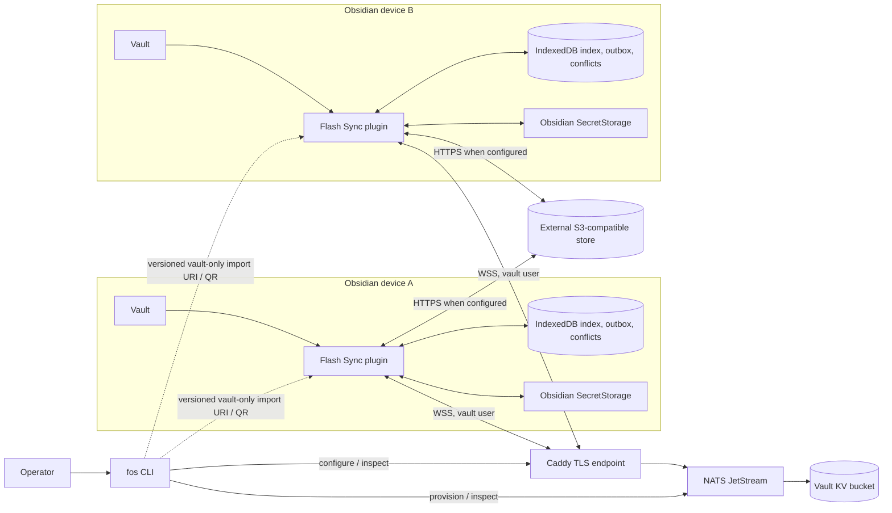

# Flash Sync — High-Level Design

| Metadata | Value |
| --- | --- |
| Status | Draft for architecture review |
| Version | 1.0 |
| Date | 2026-09-27 |
| Author | Codex |
| Requirements baseline | [Current OpenSpec capability specifications](../openspec/specs/) |
| Change history | [Archived changes](../openspec/changes/archive/) and [active changes](../openspec/changes/) |
| Protocol and API contract | Capability specifications cited in §4; implementation evidence in [`packages/protocol`](../packages/protocol/src/index.ts) and the plugin/CLI packages |

The repository has no separate PRD or API Contract for the whole product. At the owner's direction, the current capability specifications are the requirements and contract source of truth. Archived proposals explain design history; they do not override current specifications. This HLD describes the specified architecture and identifies active proposals as planned work. A specification is a contract, not evidence that every environment has been deployed or accepted.

## 1. Scope, goals, and traceability

Flash Sync is a self-hosted Obsidian community plugin for independent personal vaults on desktop and mobile. The plugin synchronizes normal Markdown directly through a vault-scoped NATS JetStream KV bucket, preserves offline work locally, and uses optional external S3-compatible storage for binary or oversized files. The separate `fos` command helps an operator provision the NATS/Caddy environment. The architecture avoids a custom server-side synchronization service. [MVP proposal](../openspec/changes/archive/2026-09-22-obsidian-sync-mvp/proposal.md), [realtime sync core](../openspec/specs/realtime-sync-core/spec.md), [server provisioning](../openspec/specs/server-provisioning/spec.md).

### 1.1 Capability requirement → HLD mapping

Requirement names below are the identifiers in the current capability specs; no separate PRD IDs are invented. Every current capability is covered here. Detailed scenarios and acceptance criteria remain in the linked specifications.

| Capability and requirement group | Architecture decision / section |
| --- | --- |
| [realtime-sync-core](../openspec/specs/realtime-sync-core/spec.md): secure remote state; truthful convergence | Per-vault access boundary (§2, §4); convergence gate (§5, §7) |
| [reconciliation](../openspec/specs/reconciliation/spec.md): complete snapshot, idempotency, safe fallback, diagnostics | One snapshot-to-live session with complete-list fallback (§5, §7) |
| [markdown-realtime](../openspec/specs/markdown-realtime/spec.md): inline propagation, idempotent apply, bounded established edits | Inline KV route and feedback suppression (§3, §5) |
| [local-durable-state](../openspec/specs/local-durable-state/spec.md): file identity, outbox, path-release dependency | Device-local durable state and ordered replay (§3, §5) |
| [file-lifecycle-sync](../openspec/specs/file-lifecycle-sync/spec.md): rename, tombstone, path reuse | Stable identity and identity-scoped lifecycle (§3, §5) |
| [remote-path-ownership](../openspec/specs/remote-path-ownership/spec.md): unique path ownership and interrupted-operation recovery | Per-path reservation with KV CAS (§3, §5) |
| [conflict-resolution](../openspec/specs/conflict-resolution/spec.md): CAS, preservation, deliberate resolution, durable audit | Client-side merge and user-directed recovery (§5, §7) |
| [blob-storage](../openspec/specs/blob-storage/spec.md): optional blob route and integrity | External immutable blob route (§3, §5) |
| [nats-connection-setup](../openspec/specs/nats-connection-setup/spec.md): manual setup and isolation | Operator-owned deployment and scoped permissions (§4, §8) |
| [sync-status-presentation](../openspec/specs/sync-status-presentation/spec.md): accessible state and success gate | Local status and conflict view (§5, §7) |
| [credential-import-handoff](../openspec/specs/credential-import-handoff/spec.md): versioned handoff and protected secrets | CLI-to-plugin boundary (§4, §6) |
| [vault-provisioning](../openspec/specs/vault-provisioning/spec.md): isolated vaults and credential lifecycle | Administrator versus plugin identity (§4, §6, §8) |
| [server-endpoint-tls](../openspec/specs/server-endpoint-tls/spec.md): verified WSS and private NATS | TLS and network exposure (§4, §6, §8) |
| [server-provisioning](../openspec/specs/server-provisioning/spec.md): source-built installer, modes, safe operations | Operator deployment boundary (§2, §8) |
| [plugin-release-distribution](../openspec/specs/plugin-release-distribution/spec.md): tag channels and install assets | Reproducible plugin delivery (§8) |

### 1.2 Change-proposal coverage and status

| Proposal | Architectural effect | Status in this HLD |
| --- | --- | --- |
| [Obsidian Sync MVP](../openspec/changes/archive/2026-09-22-obsidian-sync-mvp/proposal.md) | Plugin-centric KV, outbox, CAS, optional blobs | Archived; reflected by current specs |
| [Provision sync server](../openspec/changes/archive/2026-09-23-provision-sync-server/proposal.md) | User-run `fos`, TLS, isolated credentials | Archived; current specs prevail, including later `flash-sync` identity |
| [CLI credential import handoff](../openspec/changes/archive/2026-09-26-cli-credential-import-handoff/proposal.md) | Versioned QR/URI and opt-in vault credential retention | Archived; current specs prevail |
| [GitHub build workflow](../openspec/changes/archive/2026-09-26-github-build-workflow/proposal.md) | Tag-driven release channels and `flash-sync` identity | Archived; current specs prevail |
| [Skip path scan for content edits](../openspec/changes/archive/2026-09-26-skip-path-scan-for-content-edits/proposal.md) | Bounded established-file edits | Archived; current spec prevails |
| [Reserve remote file paths](../openspec/changes/archive/2026-09-26-reserve-remote-file-paths/proposal.md) | Authoritative path reservation | Archived; supersedes the historical baseline's “no remote path index” decision |
| [Order delete before path reuse](../openspec/changes/archive/2026-09-26-order-delete-before-path-reuse/proposal.md) | Durable cross-file causal dependency | Archived; current specs prevail |
| [Resolve plugin conflicts](../openspec/changes/archive/2026-09-26-resolve-plugin-conflicts/proposal.md) | Deliberate resolution, durable audit, status UI | Archived; current specs prevail |
| [Optimize KV startup discovery](../openspec/changes/archive/2026-09-27-optimize-kv-startup-discovery/proposal.md) | Pull snapshot continuing into live delivery | Archived; current reconciliation spec prevails |
| [Reliable startup connection](../openspec/changes/reliable-startup-connection/proposal.md) | Automatic startup/retry correction | **Active proposal; planned, not a current-spec guarantee** |
| [Remote SSH server bootstrap](../openspec/changes/remote-ssh-server-bootstrap/proposal.md) | Local-to-server SSH orchestration | **Active proposal; planned, not part of current `fos` contract** |

## 2. System boundary and component architecture



The plugin owns vault events, local durability, remote record interpretation, reconciliation, merge/conflict behavior, and status. NATS owns authenticated KV state, revisions, CAS, and delivery; it does not interpret Markdown or Obsidian paths. Caddy terminates public TLS and forwards to a private NATS WebSocket listener. Optional S3 stores immutable large or binary bytes. `fos` is an operator tool, outside the synchronization data path. [MVP proposal](../openspec/changes/archive/2026-09-22-obsidian-sync-mvp/proposal.md), [server provisioning spec](../openspec/specs/server-provisioning/spec.md), [endpoint spec](../openspec/specs/server-endpoint-tls/spec.md).

The repository is a TypeScript npm-workspace project. The browser-targeted Obsidian plugin uses the shared protocol package, NATS JavaScript packages, and an S3 client; `fos` is a separate Node.js CLI package. This is existing implementation evidence, not a requirement to add another service. [Root package](../package.json), [plugin package](../packages/plugin/package.json), [CLI package](../packages/server-cli/package.json).

### 2.1 Reuse and choice record

| Need | Chosen existing capability and reason | Evidence |
| --- | --- | --- |
| Durable remote revisions and live changes | NATS JetStream KV provides current state, per-key CAS, and delivery without a custom sync server | [realtime-sync-core](../openspec/specs/realtime-sync-core/spec.md), [MVP proposal](../openspec/changes/archive/2026-09-22-obsidian-sync-mvp/proposal.md) |
| Offline mutation safety | IndexedDB outbox is device-local and survives restart before remote publication | [local-durable-state](../openspec/specs/local-durable-state/spec.md) |
| Shared wire validation | Reuse the repository's protocol package for remote file and ownership records | [protocol source](../packages/protocol/src/index.ts), [remote-path-ownership](../openspec/specs/remote-path-ownership/spec.md) |
| Large-content storage | External S3-compatible storage keeps binary bytes off the normal Markdown KV path and remains optional | [blob-storage](../openspec/specs/blob-storage/spec.md) |
| HTTPS/WSS ingress | Caddy terminates TLS while NATS listeners stay private | [server-endpoint-tls](../openspec/specs/server-endpoint-tls/spec.md) |
| Conflict visibility | Obsidian Settings/status plus local review notes and audit avoid a separate web application | [conflict-resolution](../openspec/specs/conflict-resolution/spec.md), [sync-status-presentation](../openspec/specs/sync-status-presentation/spec.md) |

## 3. Data ownership and consistency

| Concept | Authority | Architectural rule |
| --- | --- | --- |
| Current synchronized file state | Per-vault NATS KV file record | Stable `fileId` survives rename; revision controls CAS; tombstones preserve deletion. [File lifecycle](../openspec/specs/file-lifecycle-sync/spec.md) |
| Normalized path ownership | Per-vault NATS KV ownership record | A competing identity cannot claim the same normalized, case-folded path. Reservation and file-record writes are recoverable across interruption. [Remote path ownership](../openspec/specs/remote-path-ownership/spec.md) |
| Unpublished local edits and dependencies | Device-local IndexedDB | Durable outbox precedes remote writes; dependency orders path-releasing delete before path reuse. [Local durable state](../openspec/specs/local-durable-state/spec.md) |
| Large or binary bytes | External S3 object after upload; KV carries reference | SHA-256 content addressing; upload before reference publication; verify download before apply. With no valid S3 settings, affected files remain local and unsynchronized. [Blob storage](../openspec/specs/blob-storage/spec.md) |
| Conflict decisions and history | Device-local durable state and preserved vault copies | Unsafe merge never discards either version; action completion waits for required remote confirmation. [Conflict resolution](../openspec/specs/conflict-resolution/spec.md) |

The remote storage is not a multi-key transaction store. File records and ownership records therefore form a recoverable protocol: reserve a path before a live file record claims it, retain durable operation context, and reconcile an interrupted reservation or release. Client timestamps are diagnostic only; KV revisions and CAS decide concurrency. [Remote path ownership](../openspec/specs/remote-path-ownership/spec.md), [conflict resolution](../openspec/specs/conflict-resolution/spec.md), [protocol source](../packages/protocol/src/index.ts).

The original [architecture baseline](../openspec/specs/obsidian-realtime-sync-architecture.md) predates path ownership and startup snapshot discovery. Its no-path-index decision is superseded by the current [ownership spec](../openspec/specs/remote-path-ownership/spec.md); its watcher-startup approach is superseded by the current [reconciliation spec](../openspec/specs/reconciliation/spec.md). This HLD follows current specs where they differ.

## 4. Protocol, API, and trust boundaries

This document **references** the contracts; it does not redefine payload fields, validation rules, subject permissions, API commands, or error text.

| Boundary | Contract source | Architectural use |
| --- | --- | --- |
| Plugin ↔ NATS KV | [realtime-sync-core](../openspec/specs/realtime-sync-core/spec.md), [reconciliation](../openspec/specs/reconciliation/spec.md), [remote-path-ownership](../openspec/specs/remote-path-ownership/spec.md), [file-lifecycle-sync](../openspec/specs/file-lifecycle-sync/spec.md), [protocol package](../packages/protocol/src/index.ts) | Vault-scoped file state, ownership CAS, snapshot/live delivery, tombstones |
| Plugin ↔ external S3 | [blob-storage](../openspec/specs/blob-storage/spec.md) | Optional immutable object upload/download and integrity verification |
| `fos` ↔ NATS/Caddy | [server-provisioning](../openspec/specs/server-provisioning/spec.md), [vault-provisioning](../openspec/specs/vault-provisioning/spec.md), [server-endpoint-tls](../openspec/specs/server-endpoint-tls/spec.md) | User-run installation, health check, bucket/user management, private upstream |
| `fos` → Obsidian plugin | [credential-import-handoff](../openspec/specs/credential-import-handoff/spec.md), [vault-provisioning](../openspec/specs/vault-provisioning/spec.md) | Versioned URI/QR handoff; vault credentials only; plugin stores passwords in SecretStorage |
| Plugin → user | [sync-status-presentation](../openspec/specs/sync-status-presentation/spec.md), [conflict-resolution](../openspec/specs/conflict-resolution/spec.md) | Status, deliberate conflict resolution, local review/audit |
| Release → manual install | [plugin-release-distribution](../openspec/specs/plugin-release-distribution/spec.md), [server-provisioning](../openspec/specs/server-provisioning/spec.md) | Matching `main.js`/`manifest.json` assets under the `flash-sync` plugin identity |

One bucket and dedicated NATS user belong to each vault. The plugin user receives only that bucket's KV and required JetStream API permissions; the administrative credential stays with the operator and is never put in a plugin handoff. A vault ID or bucket name is routing information, not authorization. Public entry is the verified domain `wss://` endpoint; NATS client and WebSocket listeners remain private, and the specified installer does not expose NATS monitoring. [Vault provisioning](../openspec/specs/vault-provisioning/spec.md), [connection setup](../openspec/specs/nats-connection-setup/spec.md), [endpoint TLS](../openspec/specs/server-endpoint-tls/spec.md).

### 4.1 Cross-boundary failure classes

The capability specs define behavior, but no product-wide numeric error-code registry. The HLD therefore preserves these **classes** without assigning new codes or messages:

| Class | Required treatment | Contract |
| --- | --- | --- |
| Authentication rejection | Show an authentication error, retain files/outbox, and stop replay until credentials are valid | [realtime-sync-core](../openspec/specs/realtime-sync-core/spec.md) |
| Incomplete discovery / connection loss | Withhold synchronized status; complete safe fallback or retry complete reconciliation after reconnect | [reconciliation](../openspec/specs/reconciliation/spec.md) |
| CAS mismatch / path collision | Preserve both contents and enter merge or user-review flow; never select by client timestamp | [conflict-resolution](../openspec/specs/conflict-resolution/spec.md), [remote-path-ownership](../openspec/specs/remote-path-ownership/spec.md) |
| Missing S3 configuration / corrupt blob | Keep affected file local or reject downloaded bytes, expose incomplete/error state, continue unrelated inline Markdown | [blob-storage](../openspec/specs/blob-storage/spec.md) |
| Invalid credential import | Reject before changing saved settings or secrets | [credential-import-handoff](../openspec/specs/credential-import-handoff/spec.md) |

## 5. Key flows

### 5.1 Startup, reconnect, and live continuation

```mermaid
sequenceDiagram
  participant O as Obsidian vault
  participant P as Plugin sync engine
  participant L as IndexedDB
  participant K as Vault JetStream KV
  O->>P: Start or resume
  P->>L: Load index, pending work, conflicts
  P->>K: Authenticate; open configured bucket
  P->>K: Start ephemeral current-state pull session
  K-->>P: Current file records, including tombstones
  K-->>P: Complete-snapshot signal
  alt Complete snapshot established
    P->>P: Reconcile records; retain overlapping live events
  else Completion unavailable
    P->>K: Complete-list fallback
    K-->>P: Complete current state
    P->>P: Reconcile before replay
  end
  P->>L: Preserve or replay pending operations through CAS
  K-->>P: Continued live changes
  P->>O: Idempotent remote apply; suppress feedback
  P->>P: Report synchronized only if all gates pass
```

The primary session currently filters the `f.` file-record namespace; it delivers current file records, including tombstones, and continues live file delivery without a gap. Path ownership records are a separate KV namespace consulted through bounded reads/CAS during path claims and recovery; they are not delivered by that pull session. The fallback must also finish complete file discovery before pending work replays. The synchronized state additionally requires connection, no applicable outbox work, no unresolved conflicts, and complete required blob transfers. The [reconciliation spec](../openspec/specs/reconciliation/spec.md) says “every current record”; whether that wording intentionally includes ownership records needs contract review, because the [current adapter](../packages/plugin/src/connection.ts) filters file records and the [engine](../packages/plugin/src/markdown-sync.ts) reconciles those records. This HLD does not claim a full-bucket snapshot. [Realtime sync core](../openspec/specs/realtime-sync-core/spec.md).

### 5.2 Local mutation and conflict

```mermaid
sequenceDiagram
  participant O as Obsidian vault
  participant P as Plugin sync engine
  participant L as IndexedDB
  participant K as Vault KV
  participant S as External S3 if needed
  O->>P: Create, edit, rename, or delete
  P->>L: Persist identity and outbox operation
  opt Binary or oversized content and S3 configured
    P->>S: Upload immutable blob
    S-->>P: Upload confirmed
  end
  opt New or changed path
    P->>K: Reserve normalized destination by CAS
  end
  P->>K: Publish file record or tombstone by revision CAS
  alt CAS succeeds
    K-->>P: Confirmed revision
    P->>L: Confirm outbox; update local index
  else CAS or ownership conflicts
    K-->>P: Current remote state
    P->>P: Safe three-way merge or preserve both versions
    P->>L: Retain pending work / durable conflict record
    P-->>O: Show reviewable conflict
  end
```

Ordinary edits to an established file and unchanged path avoid a vault-wide collision scan. Create/rename/path drift use bounded ownership operations. Delete is a tombstone for one `fileId`; dependent path reuse waits until that delete is confirmed. Conflict review offers Keep remote, Keep local copy, or explicit manual resolution, with stale-revision rechecks and durable audit. [Markdown realtime](../openspec/specs/markdown-realtime/spec.md), [file lifecycle](../openspec/specs/file-lifecycle-sync/spec.md), [conflict resolution](../openspec/specs/conflict-resolution/spec.md).

## 6. Security, privacy, and compatibility

NATS passwords and configured S3 **secret access keys** belong in Obsidian SecretStorage; ordinary plugin settings retain opaque references to those secrets. The S3 access key ID and nonsecret endpoint, bucket, and region are settings. The CLI retains its administrator credential separately in a protected root-owned local store; vault plaintext retention requires explicit `--keep`. A handoff contains only the vault credential, may be plaintext or encrypted under the versioned contract, and must never include administrator credentials. Imported vault identity must match any existing device binding. [Credential import](../openspec/specs/credential-import-handoff/spec.md), [plugin settings implementation](../packages/plugin/src/main.ts), [vault provisioning](../openspec/specs/vault-provisioning/spec.md).

Existing records and pending work are preserved across disconnect, retry, and plugin restart. Remote record schema is versioned in the shared protocol implementation. The current specs do not authorize an automatic production data migration or clearing a vault to adopt an optimization; the archived path-ownership proposal limits its reset discussion to selected development vaults with backup and clean-state checks. The release process uses the current `flash-sync` manifest identity. [Protocol source](../packages/protocol/src/index.ts), [path ownership proposal](../openspec/changes/archive/2026-09-26-reserve-remote-file-paths/proposal.md), [release spec](../openspec/specs/plugin-release-distribution/spec.md).

## 7. Nonfunctional strategy and observability

| Concern | Strategy and evidence |
| --- | --- |
| Latency | Inline Markdown travels through KV rather than S3. Established edits and path claims avoid full-vault scans. Startup discovery uses a snapshot pull session with a complete-list fallback. The [historical architecture baseline](../openspec/specs/obsidian-realtime-sync-architecture.md) states online propagation goals; the [current realtime spec](../openspec/specs/realtime-sync-core/spec.md) expects normal active-device apply within one second after debounce. Neither contract promises a fixed discovery speedup. |
| Durability | IndexedDB outbox precedes remote publication; KV records and tombstones persist remote state; unsafe conflicts preserve both versions. [Local durable state](../openspec/specs/local-durable-state/spec.md), [conflict resolution](../openspec/specs/conflict-resolution/spec.md). |
| Availability | Offline vault editing remains local; reconnect performs complete reconciliation and replay. Missing optional S3 blocks affected files, not unrelated inline Markdown. [Reconciliation](../openspec/specs/reconciliation/spec.md), [blob storage](../openspec/specs/blob-storage/spec.md). |
| Data integrity | CAS controls concurrent writes; path ownership prevents two live identities from claiming a normalized path; downloaded blobs are hash-verified. [Conflict resolution](../openspec/specs/conflict-resolution/spec.md), [remote path ownership](../openspec/specs/remote-path-ownership/spec.md), [blob storage](../openspec/specs/blob-storage/spec.md). |
| Local diagnostics | Discovery path, record count, completion, fallback, and duration are measured without content or secrets. Conflict audit persists operational metadata only. UI status never shows success while work or conflicts remain. [Reconciliation](../openspec/specs/reconciliation/spec.md), [conflict resolution](../openspec/specs/conflict-resolution/spec.md), [status spec](../openspec/specs/sync-status-presentation/spec.md). |

The repeatable [KV discovery benchmark](../tests/benchmark/kv-discovery.bench.test.ts) supports comparison of primary and fallback paths on representative data. It is a measurement tool, not a service-level guarantee. Operator-visible `fos` status and health checks are specified in [server provisioning](../openspec/specs/server-provisioning/spec.md); centralized telemetry or automatic paging is not specified here.

## 8. Deployment and release boundary

An operator supplies a supported Linux host, domain, and NATS/Caddy deployment. `fos` supports native, Docker Compose, or Podman Compose installation on the specified Debian/Ubuntu amd64 releases. Only Caddy ports 80/443 are public; NATS listeners and JetStream file storage remain private/persistent. S3 is an external optional service. The operator owns deployment, backup, incident response, firewall choices, credential rotation, and rollback of server state. [Server provisioning](../openspec/specs/server-provisioning/spec.md), [endpoint TLS](../openspec/specs/server-endpoint-tls/spec.md), [vault provisioning](../openspec/specs/vault-provisioning/spec.md).

Plugin delivery is independent of server deployment. Tag validation, build, and tests precede release assets. Stable and prerelease GitHub Releases supply matching `main.js` and `manifest.json`; development tags supply CI artifacts. Manual installation places the matching files under `.obsidian/plugins/flash-sync`. Release channels and version/branch rules are in [plugin-release-distribution](../openspec/specs/plugin-release-distribution/spec.md), not restated as a new contract here. The source-build and CLI installation paths are in [README](../README.md) and [fos install guide](fos-install.md).

Rollback of a plugin build must preserve device-local IndexedDB, vault files, conflict copies, and server KV/blob data; any downgrade that changes protocol semantics needs a separately reviewed compatibility plan. No general backward-compatibility guarantee for mixed plugin versions is stated by the current specs. The archived path-ownership proposal explicitly describes development-mode reset boundaries rather than a production migration. [Local durable state](../openspec/specs/local-durable-state/spec.md), [path ownership proposal](../openspec/changes/archive/2026-09-26-reserve-remote-file-paths/proposal.md).

## 9. Risks, planned changes, and decision boundaries

| Risk or open item | Present boundary / treatment |
| --- | --- |
| Multi-key ownership/file updates can be interrupted | Durable operation context and recovery are required; do not assume an atomic multi-key transaction. [Remote path ownership](../openspec/specs/remote-path-ownership/spec.md). |
| Snapshot completion may fail, especially around mobile suspension | Complete-list fallback or remain unsynchronized; preserve outbox and retry full reconciliation after reconnect. [Reconciliation](../openspec/specs/reconciliation/spec.md). |
| “Every current record” in the reconciliation spec can be read to include path ownership records | The implemented snapshot and reconciliation filter to `f.` file records; ownership is accessed separately. Clarify the contract's intended scope before claiming full-bucket snapshot coverage. [Reconciliation](../openspec/specs/reconciliation/spec.md), [adapter](../packages/plugin/src/connection.ts), [engine](../packages/plugin/src/markdown-sync.ts). |
| Unsafe concurrent edits and path collisions | Preserve both versions and require deliberate resolution; do not choose by client clock. [Conflict resolution](../openspec/specs/conflict-resolution/spec.md). |
| External S3 or credentials may be absent | Inline Markdown remains usable; blob-dependent files stay local and unsynchronized. [Blob storage](../openspec/specs/blob-storage/spec.md). |
| Startup may still need manual Connect after a failed initial attempt | [Reliable startup connection](../openspec/changes/reliable-startup-connection/proposal.md) is an active proposal. It is **not** claimed as a delivered property here. |
| Starting server bootstrap from a local machine | [Remote SSH server bootstrap](../openspec/changes/remote-ssh-server-bootstrap/proposal.md) is an active proposal. The current [server provisioning spec](../openspec/specs/server-provisioning/spec.md) requires running `fos` on the target host. |

## 10. Evidence and review notes

The source set for this HLD includes all 15 current capability specifications and all 11 proposals under active and archived changes as of the date above. The [historical architecture baseline](../openspec/specs/obsidian-realtime-sync-architecture.md), package manifests, and shared protocol source were consulted to describe implementation shape; where they conflict with current capability specs, the specs take precedence. This HLD contains no new wire schema, error-code registry, timeout, retry count, or storage migration procedure. Review of implementation conformance and live host state is a separate acceptance activity.
