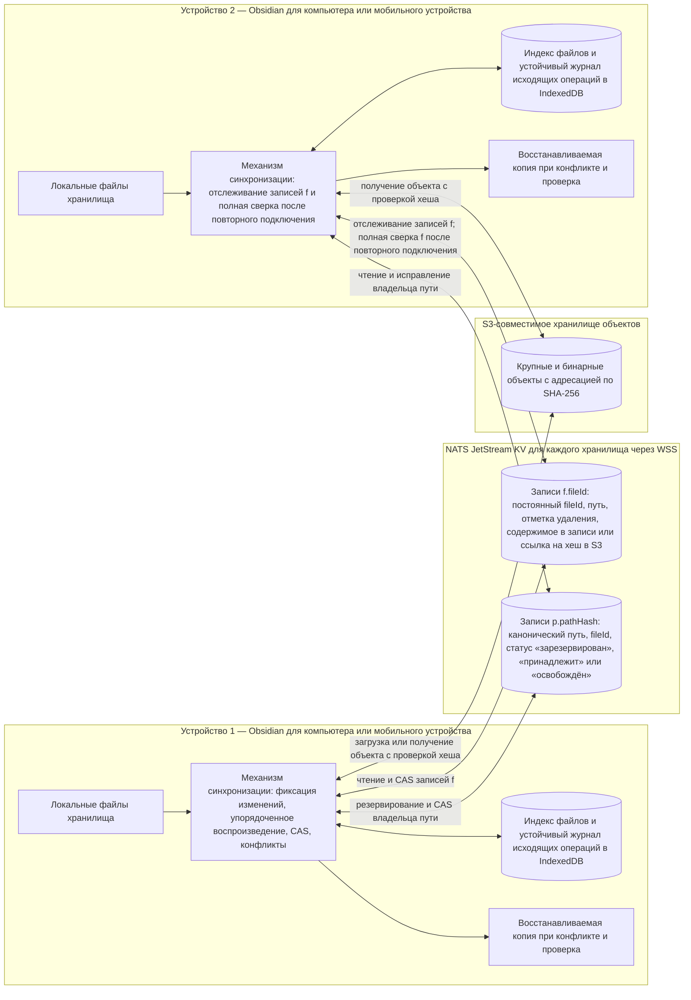
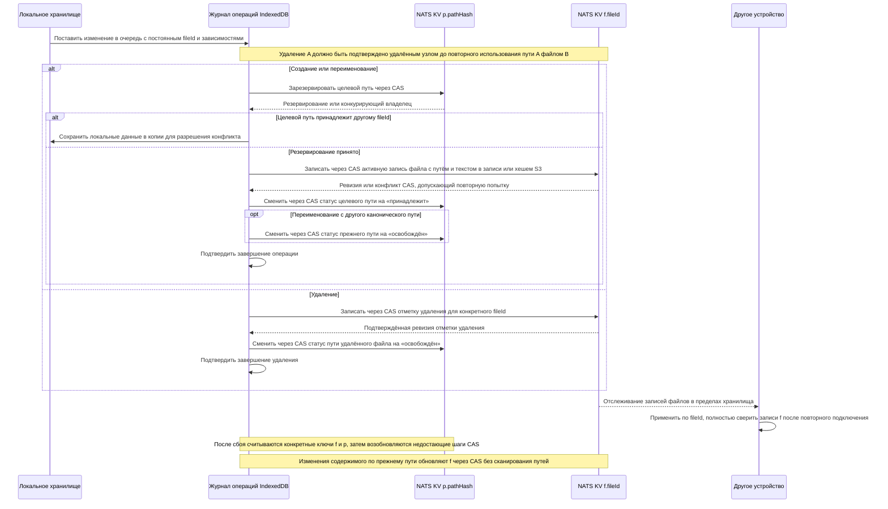

# Архитектура после трёх предложенных изменений

Это целевая архитектура после реализации `order-delete-before-path-reuse`, `skip-path-scan-for-content-edits` и `reserve-remote-file-paths`. Документ описывает планируемое состояние, а не уже развёрнутое поведение. Предложения сохраняют по одному бакету KV на хранилище Obsidian и не предусматривают разделения на бакеты META/BLOB или курсора для повторного подключения.

Владение путём определяет право занять его; запись `f.<fileId>` остаётся источником истины для содержимого файла и состояния удаления. Статус `reserved` не позволяет другим файлам занять путь, пока исходная устойчивая операция не возобновится или пока другое устройство не завершит её на основании соответствующей записи `f.`. При настоящем конфликте содержимое обоих файлов остаётся доступным для восстановления. Обычный Markdown хранится непосредственно в записях `f.`; только бинарные или слишком большие данные помещаются в S3-совместимое хранилище объектов с адресацией по SHA-256.
