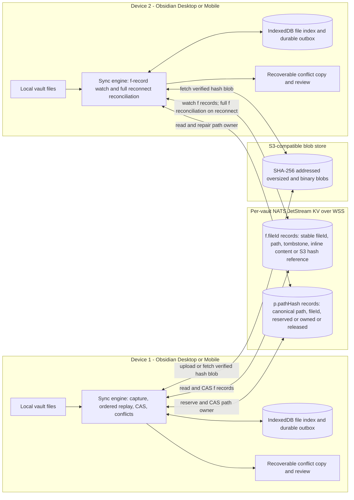

# Architecture after the three proposed changes

This is the target design after `order-delete-before-path-reuse`, `skip-path-scan-for-content-edits`, and `reserve-remote-file-paths` are implemented. It is planning state, not a description of deployed behavior. The proposals retain one KV bucket per vault and do not add a META/BLOB bucket split or reconnect cursor.



```mermaid
sequenceDiagram
  participant V as Local vault
  participant O as IndexedDB outbox
  participant P as NATS KV p.pathHash
  participant F as NATS KV f.fileId
  participant R as Other device

  V->>O: Queue mutation with stable fileId and dependencies
  Note over O,F: A delete must be remotely confirmed before B reuses A's path
  alt Create or rename
    O->>P: CAS reserve destination path
    P-->>O: Reservation or competing owner
    alt Competing fileId owns destination
      O->>V: Preserve local bytes as conflict copy
    else Reservation accepted
      O->>F: CAS live file record with path and inline text or S3 hash
      F-->>O: Revision or retryable CAS race
      O->>P: CAS destination to owned
      opt Rename from a different canonical path
        O->>P: CAS former path to released
      end
      O->>O: Acknowledge completed operation
    end
  else Delete
    O->>F: CAS identity-scoped tombstone
    F-->>O: Confirmed tombstone revision
    O->>P: CAS deleted file's path to released
    O->>O: Acknowledge completed delete
  end
  F-->>R: Per-vault file-record watch
  R->>R: Apply by fileId; full f-record reconciliation on reconnect
  Note over O,P: Crash recovery reads specific f and p keys and resumes missing CAS steps
  Note over O,F: Established same-path content edits CAS f directly without a path scan
```

Path ownership is authoritative for claims; `f.<fileId>` remains authoritative for file content and tombstone state. A `reserved` path blocks other identities until the originating durable operation resumes or matching `f.` evidence lets a peer finalize it. A genuine collision keeps both contents recoverable. Normal Markdown remains inline in `f.` records; only binary or oversized bytes use S3-compatible SHA-256 blobs.
