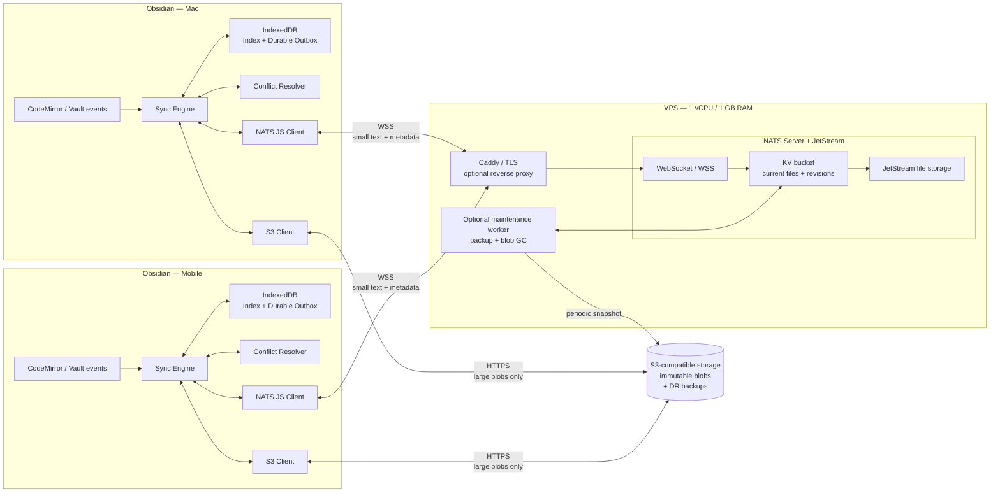
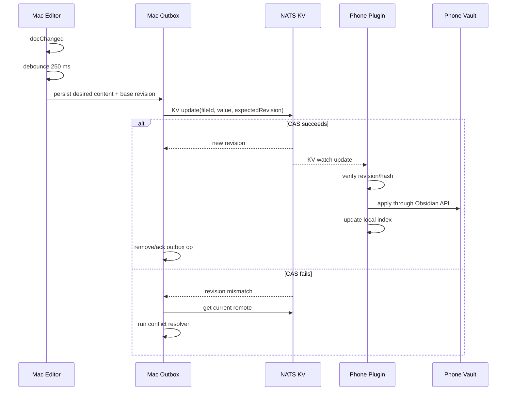
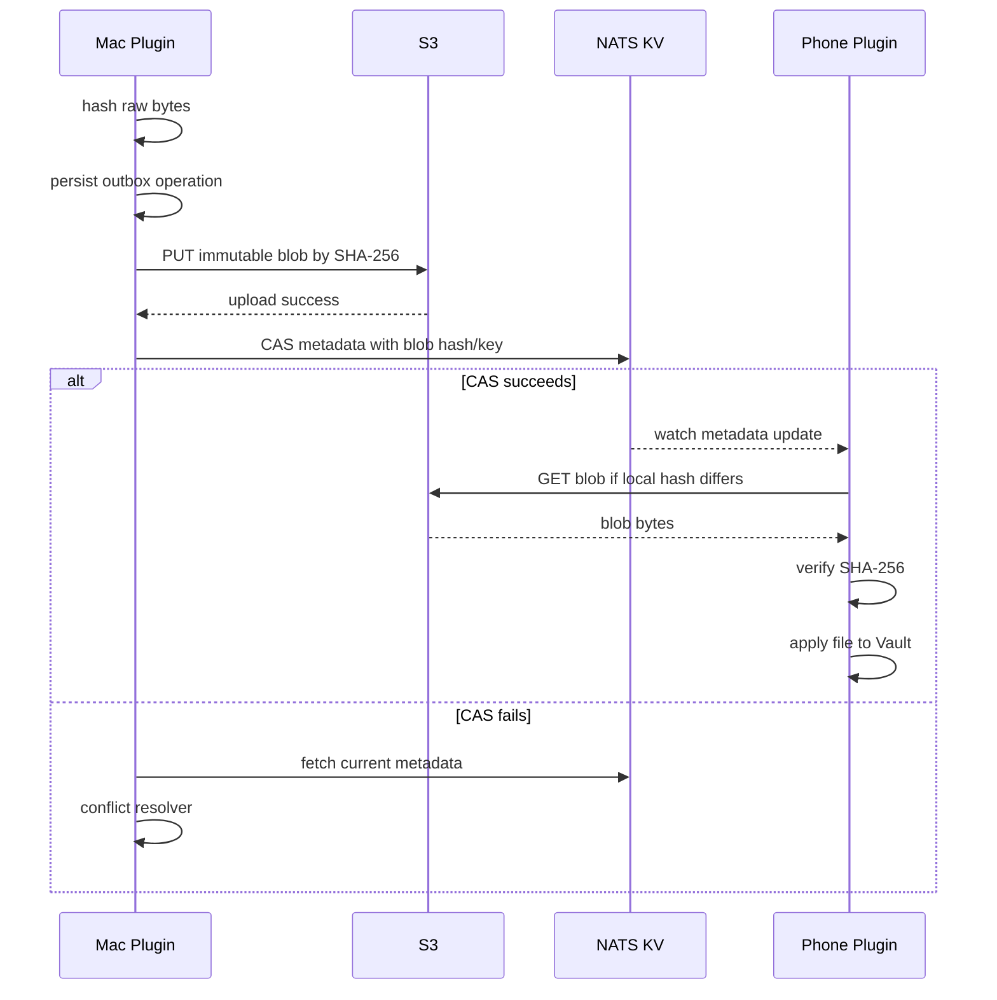
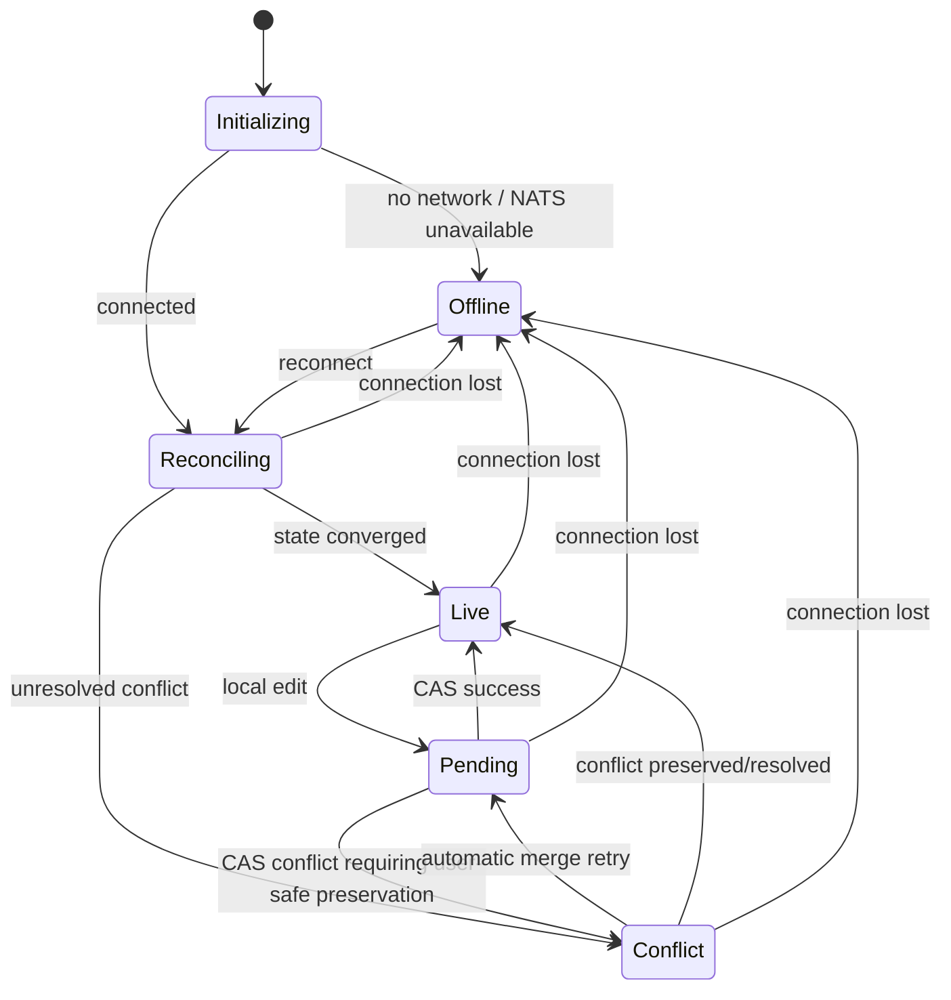

# Architecture: Realtime Sync for Obsidian

**Status:** Architecture baseline / input for OpenSpec  
**Date:** 2026-09-21  
**Target:** personal/self-hosted realtime synchronization between Obsidian devices  
**Primary stack:** Obsidian Community Plugin + NATS JetStream KV + S3-compatible object storage + custom client-side conflict resolver

---

## 1. Purpose

Build a lightweight self-hosted alternative to Obsidian LiveSync with the following properties:

- realtime synchronization of Markdown files between devices;
- target propagation latency of **0.5–1.0 seconds** while both Obsidian instances are active and the network is healthy;
- offline-first behavior;
- deterministic conflict detection with no silent data loss;
- low infrastructure cost;
- support for Obsidian Desktop and Obsidian Mobile;
- S3-compatible object storage for large/binary files;
- minimal custom server-side code;
- no CouchDB, PostgreSQL, Redis, Kafka, or custom message journal;
- NATS JetStream/KV is responsible for realtime delivery, persistence, revisions, watching, and CAS;
- the plugin is responsible for Obsidian filesystem semantics and conflict resolution.

This document is intended to be sufficiently concrete to derive one or more OpenSpec changes and start implementation with Codex.

---

## 2. Constraints

### 2.1 Infrastructure

Target infrastructure:

- VPS:
  - 1 vCPU;
  - 1 GB RAM;
  - 15 GB local disk;
- S3-compatible object storage:
  - 10 GB;
  - inexpensive storage;
  - limited free outbound traffic;
- expected devices:
  - normally 2–5;
  - desktop + phone is the primary scenario.

The design must not require a heavyweight database or multiple persistent server processes.

### 2.2 Performance

For small Markdown updates while both devices are online:

- p50 target: **< 500 ms** from local debounce completion to remote apply;
- p95 target: **< 1 second**;
- reconnect target: live connection restored in approximately 1 second under normal network conditions;
- large binary transfer time is excluded from the 1-second requirement;
- notification that a large binary changed should still be realtime.

The latency target does **not** apply while a mobile OS has suspended Obsidian in the background.

### 2.3 Reliability

The system must prioritize preservation of user data over automatic conflict resolution.

Required invariants:

1. A local change must be stored durably in the local outbox before it is considered pending synchronization.
2. A local pending operation must not be deleted until the NATS KV mutation has succeeded or the change has been preserved as a conflict copy.
3. A CAS failure must never cause the losing local content to be discarded.
4. Remote changes must be idempotent to apply.
5. Reconnect must eventually converge all active devices to the same remote state, except explicit unresolved conflicts.
6. Client clocks must not be used to determine the winning revision.

---

## 3. Architectural decisions

### AD-001 — NATS KV is the realtime state store

NATS JetStream KV is used for:

- current remote state;
- persistent revisions;
- atomic compare-and-set updates;
- realtime watches;
- initial state delivery to new watchers;
- short operational history.

No separate WebSocket hub, SQLite change journal, or custom replication server is introduced.

### AD-002 — Markdown is stored inline in KV

Normal Markdown content is stored directly inside a KV value.

A conservative initial inline limit is:

```text
INLINE_TEXT_MAX_BYTES = 512 KiB
```

Reason: NATS installations commonly use a 1 MiB maximum payload by default. A 512 KiB application limit leaves room for the sync envelope and avoids pushing the broker close to its transport limit.

If a Markdown file exceeds the inline limit, it switches to blob mode and is stored in S3 like a large file. This is an edge-case fallback, not the normal Markdown path.

The threshold must be configurable.

### AD-003 — Large/binary content is content-addressed in S3

Large files and binary attachments are stored as immutable blobs:

```text
vaults/<vaultId>/blobs/sha256/<first-2>/<sha256>
```

NATS KV stores only metadata and the blob hash.

Examples:

- PNG;
- JPEG;
- PDF;
- video;
- archive;
- any file above the inline threshold.

### AD-004 — File identity is independent of path

Every synchronized file has a stable random `fileId`.

```text
fileId != path
```

Rename changes the path in the same KV entry.

This avoids representing rename as delete + create and enables conflict handling such as:

```text
rename on Mac + edit on iPhone
```

### AD-005 — Conflict resolution is client-side

NATS detects write conflicts through KV revision/CAS.

The plugin decides what the conflict means for an Obsidian file.

For Markdown the primary strategy is three-way merge:

```text
base
local
remote
```

If the merge is unsafe, both versions are preserved.

### AD-006 — Local outbox is mandatory

Every device has a durable local IndexedDB outbox.

NATS is remote durable state, but the local outbox protects a local change during:

- network loss;
- server outage;
- CAS conflict;
- application crash;
- mobile suspension.

### AD-007 — S3 is not on the Markdown realtime path

Normal text synchronization is:

```text
Obsidian -> NATS KV -> Obsidian
```

not:

```text
Obsidian -> S3 -> notification -> S3 -> Obsidian
```

This minimizes latency and S3 egress.

### AD-008 — Deletes use persistent tombstones

Deleted files are not immediately purged from KV.

The latest value remains a compact tombstone so that a device returning after a long offline period cannot silently resurrect an old file.

Tombstone GC is not required for MVP.

### AD-009 — Direct S3 credentials are acceptable for MVP

For the first self-hosted personal version, the plugin may use dedicated S3 credentials restricted to a single bucket/prefix and stored through Obsidian SecretStorage.

A later hardened mode can introduce a tiny presign service so clients never receive long-lived S3 credentials.

This service is explicitly **not** required for realtime text synchronization.

### AD-010 — Server timestamps are informational only

Ordering and concurrency are based on NATS KV revisions.

`modifiedAt` values exist only for diagnostics and UI.

---

# 4. High-level architecture



## 4.1 Runtime source-of-truth matrix

| Data | Runtime source of truth | Local representation | Backup |
|---|---|---|---|
| Markdown <= inline limit | NATS KV | Vault file | optional periodic S3 snapshot |
| Large Markdown | S3 blob + NATS metadata | Vault file | same S3 immutable blob |
| Binary attachment | S3 blob + NATS metadata | Vault file | same S3 immutable blob |
| File path | NATS KV | local index + Vault | periodic metadata snapshot |
| File deletion | NATS KV tombstone | file absent locally | metadata snapshot |
| Pending local operation | local IndexedDB outbox | IndexedDB | no remote dependency |
| NATS state | JetStream local disk | — | periodic S3 DR snapshot |

---

# 5. Components

## 5.1 Obsidian plugin

The plugin is the main application component.

Responsibilities:

- observe local Obsidian changes;
- maintain stable `fileId <-> path` mapping;
- classify files as inline text or S3 blob;
- hash content;
- maintain durable local outbox;
- connect directly to NATS over WSS;
- watch the vault KV bucket;
- perform CAS writes;
- detect CAS conflicts;
- perform three-way Markdown merges;
- preserve unmergeable changes as conflict copies;
- upload/download S3 blobs;
- reconcile after reconnect;
- apply remote changes through supported Obsidian APIs;
- prevent feedback loops when a remote change triggers local Vault events;
- show sync/conflict state to the user.

The plugin must be mobile compatible and therefore must not depend on Node.js or Electron APIs.

## 5.2 NATS Server + JetStream

NATS runs on the VPS.

Responsibilities:

- WSS connectivity;
- KV persistence;
- file-level revisions;
- realtime watch delivery;
- CAS enforcement;
- recent history;
- server-side persistence to JetStream file storage.

NATS does **not** understand:

- Markdown;
- directories;
- rename semantics;
- merge semantics;
- Obsidian configuration;
- S3 blob contents.

## 5.3 S3-compatible object storage

Responsibilities:

- immutable large/binary blobs;
- deduplication through content-addressed keys;
- optional disaster-recovery snapshots of KV/text state.

S3 is not queried for normal Markdown synchronization.

## 5.4 Optional maintenance worker

A small optional process on the VPS can be introduced without entering the realtime path.

Responsibilities:

- periodic KV snapshot/export to S3;
- S3 blob garbage collection;
- integrity checks;
- later: generation of S3 presigned URLs.

Implementation preference:

```text
Go single binary
```

or a small TypeScript/Bun process if code sharing is materially useful.

The system must remain operational for realtime sync if the maintenance worker is down.

---

# 6. NATS topology

## 6.1 One KV bucket per vault

Recommended naming:

```text
OBS_<vaultIdNormalized>_FILES
```

Example:

```text
OBS_01J8V9Y6H5KX_FILES
```

The exact allowed naming scheme must be validated against the NATS version used during implementation.

Initial bucket configuration:

```yaml
storage: file
history: 10
replicas: 1
```

Rationale:

- one VPS means replication factor 1;
- history 10 is sufficient as short operational history;
- long-term version history belongs in a later feature / S3 backup, not in NATS KV.

Suggested JetStream disk budget:

```text
max_file_store: ~6 GiB
```

The exact number should leave comfortable room for:

- OS;
- Docker/container data;
- logs;
- Caddy;
- temporary files.

The server must alert before the disk becomes full.

## 6.2 Key structure

Primary file entry:

```text
f.<fileId>
```

Example:

```text
f.550e8400-e29b-41d4-a716-446655440000
```

Optional system metadata can use a separate bucket later. MVP should avoid unnecessary high-frequency metadata.

No remote `path -> fileId` index is required in MVP.

Each client maintains that mapping locally.

This deliberately avoids a distributed multi-key transaction during rename.

## 6.3 Why no remote path index initially

NATS KV CAS is atomic per key, not as a general transaction across multiple keys.

Maintaining:

```text
fileId -> file
path -> fileId
```

would require consistency between two keys.

Instead:

- `f.<fileId>` is canonical;
- `path` is a property of that record;
- clients detect duplicate live paths during reconciliation;
- duplicate paths are resolved conservatively.

This keeps rename a single CAS mutation.

---

# 7. Remote file record

Recommended logical schema:

```ts
type RemoteFileRecord = {
  schemaVersion: 1;

  fileId: string;
  path: string;

  kind: "text" | "blob";

  deleted: boolean;

  contentHash: string;   // sha256:<hex>
  size: number;

  mime?: string;

  // Present only for kind=text and deleted=false
  content?: string;

  // Present only for kind=blob and deleted=false
  blob?: {
    algorithm: "sha256";
    hash: string;
    key: string;
    size: number;
    etag?: string;
  };

  // Diagnostics only. Never used to resolve ordering.
  origin: {
    deviceId: string;
    operationId: string;
    modifiedAtClient: string;
  };

  // Useful for diagnostics and conflict reconstruction.
  basedOnRevision?: number;

  // Optional metadata for a tombstone.
  deletion?: {
    deletedByDeviceId: string;
    deletedAtClient: string;
  };
};
```

The NATS `KvEntry.revision` is the authoritative remote revision and is **not** duplicated as the source of truth inside the value.

## 7.1 Hashing

Text:

```text
SHA-256(UTF-8 normalized exact file content)
```

Binary:

```text
SHA-256(raw bytes)
```

Do not normalize Markdown line endings before hashing unless the entire system explicitly standardizes them.

Preferred behavior is to preserve the exact content bytes represented by the plugin.

## 7.2 Encoding

MVP:

```text
UTF-8 JSON
```

Advantages:

- inspectable;
- easy debugging;
- no binary schema dependency;
- easy OpenSpec/Codex implementation.

CBOR/MessagePack can be evaluated later if JSON overhead becomes measurable.

---

# 8. Local state

Use IndexedDB for operational plugin state.

Obsidian `data.json` should contain only low-volume settings and identifiers.

Sensitive credentials must be referenced/stored using Obsidian SecretStorage.

## 8.1 Local file index

```ts
type LocalFileState = {
  fileId: string;
  path: string;

  remoteRevision: number | null;
  remoteHash: string | null;

  localHash: string | null;

  kind: "text" | "blob";

  // Used to suppress remote-apply feedback loops.
  lastAppliedRemoteHash?: string;

  // Sync state
  state:
    | "synced"
    | "pending"
    | "conflict"
    | "remote-applying"
    | "error";
};
```

Indexes:

```text
by fileId
by path
```

## 8.2 Durable outbox

```ts
type OutboxOperation = {
  operationId: string;
  fileId: string;

  type:
    | "create"
    | "modify"
    | "rename"
    | "delete";

  createdAt: string;

  baseRevision: number | null;
  baseHash: string | null;

  // Required for three-way merge of text conflicts.
  baseContent?: string;

  desiredPath: string;

  kind: "text" | "blob";

  localHash: string;

  localContent?: string;

  blob?: {
    hash: string;
    key: string;
    size: number;
    uploadState:
      | "not-started"
      | "uploading"
      | "uploaded";
  };

  attempt: number;
  lastError?: string;
};
```

### Required outbox behavior

Before any network mutation:

```text
local change
    ↓
persist OutboxOperation
    ↓
attempt remote sync
```

Never:

```text
local change
    ↓
network first
    ↓
outbox later
```

---

# 9. Change detection

Two complementary paths are required.

## 9.1 Fast editor path

For active Markdown editors, register a CodeMirror 6 editor extension.

On `ViewUpdate.docChanged`:

1. capture the current editor document;
2. debounce by approximately **200–300 ms**;
3. hash the current content;
4. if hash differs from the last queued/synchronized hash:
   - create or coalesce the durable outbox operation;
   - attempt NATS CAS.

This path exists specifically to meet the 0.5–1 second realtime target while the user is typing.

Do not publish every keystroke.

Example:

```text
typing
typing
typing
     └── 250 ms quiet period
             ↓
          one update
```

## 9.2 Vault path

Observe supported Obsidian Vault events after `workspace.onLayoutReady()`:

- create;
- modify;
- rename;
- delete.

This path catches:

- external filesystem changes;
- inactive files;
- attachments;
- changes not seen by the editor extension.

Deduplicate events by content hash and local sync state.

## 9.3 Feedback-loop suppression

Applying a remote update causes Obsidian to emit local events.

The plugin must mark an expected remote mutation before applying it:

```ts
type RemoteApplyGuard = {
  fileId: string;
  targetPath: string;
  expectedHash: string | null;
  operation: "write" | "rename" | "delete";
};
```

When the matching Vault event arrives, it is acknowledged as an echo and not queued as a new local operation.

Do not suppress unrelated changes to the same file blindly.

---

# 10. Text synchronization flow



## 10.1 Modify algorithm

Given local state:

```text
baseRevision = R
baseContent  = B
localContent = L
```

attempt:

```text
kv.update(fileKey, localRecord, R)
```

### Success

NATS returns new revision `R2`.

Actions:

1. store `remoteRevision = R2`;
2. store `remoteHash = localHash`;
3. mark local state `synced`;
4. remove/coalesce the acknowledged outbox operation.

### CAS failure

Fetch current entry:

```text
remoteRevision = Rremote
remoteContent  = T
```

Then invoke:

```text
resolve(B, L, T)
```

Never discard `L`.

---

# 11. Realtime watch

Each active plugin instance opens a NATS WSS connection and a KV watch.

Current NATS JS behavior allows a watch to emit the latest value for keys being watched and then continue with updates.

The plugin must distinguish:

- initial snapshot entries;
- subsequent live updates.

Current NATS JS exposes an `isUpdate` property on watched entries for this purpose.

## 11.1 Applying an incoming KV entry

For each watched entry:

1. parse and validate `schemaVersion`;
2. locate `LocalFileState` by `fileId`;
3. if `entry.revision <= local.remoteRevision`, ignore as already processed;
4. check whether a local pending operation exists;
5. if no pending local change:
   - apply remote value;
6. if a local pending change exists:
   - compare base/local/remote;
   - invoke conflict resolver;
7. persist the new local index state.

## 11.2 No reliance on continuous connectivity

The watch is a low-latency delivery mechanism, not the only recovery mechanism.

After reconnect, the plugin performs a reconciliation phase before declaring `synced`.

---

# 12. Reconnect and reconciliation

## 12.1 Reconnect state machine

```text
DISCONNECTED
    ↓
CONNECTING
    ↓
CONNECTED
    ↓
RECONCILING
    ↓
LIVE
```

On connection loss:

- continue recording local changes into IndexedDB;
- do not block editing;
- do not discard base revisions/content.

On reconnect:

1. reconnect to NATS;
2. establish the KV watch;
3. consume/reconcile the current remote snapshot;
4. rebuild/verify `fileId -> path` and local remote revisions;
5. process incoming remote changes;
6. replay local outbox operations in creation order per file;
7. switch to `LIVE`.

## 12.2 Why reconciliation is preferred to a custom cursor protocol

NATS KV already provides current state and watchers.

For a personal vault with a manageable number of files, a state reconciliation after a disconnected period is simpler and safer than implementing another application-level message cursor/journal.

Optimization can be added later if startup becomes measurable.

## 12.3 Revision monotonicity

The client stores the last applied NATS KV revision for every `fileId`.

It must ignore old/duplicate events.

Client wall-clock time is never used for this purpose.

---

# 13. Bootstrap / linking a device

There are three supported bootstrap modes.

## 13.1 First device, empty remote

If the KV bucket contains no files:

1. enumerate supported local Vault files;
2. generate a `fileId` for every file;
3. create local index entries;
4. upload large blobs to S3 first;
5. `kv.create()` each remote record;
6. mark the initial device synchronized.

## 13.2 New device, empty local vault

1. connect to NATS;
2. consume current KV state;
3. create directory structure lazily;
4. write inline text files;
5. download S3 blobs;
6. build local index;
7. start live watch.

## 13.3 New device with existing files

Reconcile by normalized path and content hash:

### Same path + same hash

Bind the local file to the remote `fileId`.

### Same path + different hash

Do not overwrite either side automatically when no trustworthy common base is available.

Treat as a bootstrap conflict:

- preserve remote canonical file;
- preserve local file as a conflict copy;
- surface the conflict.

### Local-only path

Create a new remote file.

### Remote-only path

Download remote file.

---

# 14. Rename semantics

Rename updates the **same** `f.<fileId>` entry.

Example:

```text
Projects/A.md
        ↓
Archive/A.md
```

Remote mutation:

```json
{
  "fileId": "...same...",
  "path": "Archive/A.md",
  "...": "..."
}
```

CAS is performed using the current known revision.

## 14.1 Rename + remote edit

If:

```text
base: path=A.md, content=X
local: path=B.md, content=X
remote: path=A.md, content=Y
```

safe automatic result:

```text
path=B.md
content=Y
```

if there is no conflicting local content edit.

If local also changed content, perform content three-way merge and retain the local rename if only one side renamed.

## 14.2 Rename + rename

If two devices rename the same file from the same base to different paths:

```text
A.md -> B.md
A.md -> C.md
```

do not silently pick one by timestamp.

Preserve both intentions:

- keep one canonical current revision;
- generate a deterministic conflict copy for the losing rename;
- notify the user.

---

# 15. Delete semantics

Delete is represented as a normal CAS update to a compact tombstone:

```json
{
  "schemaVersion": 1,
  "fileId": "...",
  "path": "Notes/A.md",
  "kind": "text",
  "deleted": true,
  "contentHash": "sha256:...",
  "size": 0,
  "origin": {
    "deviceId": "...",
    "operationId": "...",
    "modifiedAtClient": "..."
  },
  "deletion": {
    "deletedByDeviceId": "...",
    "deletedAtClient": "..."
  }
}
```

Do not immediately call KV purge.

## 15.1 Remote delete application

Use the appropriate Obsidian file-management API and respect Obsidian trash preferences.

The plugin should prefer a recoverable trash behavior over irreversible filesystem deletion.

## 15.2 Delete vs edit conflict

Scenario:

```text
base = A
device 1 = delete
device 2 = edit A -> B
```

Safe default:

- preserve the edited content;
- do not silently execute the losing delete;
- mark/report `delete-vs-edit` conflict.

Data preservation wins over faithfully reproducing the delete.

The user can delete the surviving file again after review.

## 15.3 Tombstone retention

MVP:

```text
retain tombstones indefinitely
```

Tombstones are small and prevent stale offline devices from resurrecting old data.

A future GC design may remove old tombstones only if it has a durable anti-resurrection mechanism.

---

# 16. Large file / attachment flow



## 16.1 Upload ordering

Required ordering:

```text
S3 blob upload
    BEFORE
KV metadata commit
```

This prevents remote metadata from pointing to an object that does not yet exist.

A CAS failure after upload may leave an orphaned S3 blob.

That is acceptable.

A later GC pass removes old unreferenced blobs.

## 16.2 Content-addressed S3 keys

Recommended:

```text
vaults/<vaultId>/blobs/sha256/<hash[0:2]>/<hash>
```

Properties:

- immutable;
- natural deduplication;
- retry-safe;
- no need for S3 object versioning for normal blob history;
- integrity is verifiable by SHA-256.

## 16.3 Download

A device downloads the blob only if:

```text
local SHA-256 != remote blob hash
```

After download:

1. verify size;
2. verify SHA-256;
3. only then replace/create the Vault file.

---

# 17. Conflict resolver

The conflict resolver is a pure domain component where possible.

Recommended interface:

```ts
type ConflictInput = {
  fileId: string;

  base: FileVersion | null;
  local: FileVersion;
  remote: FileVersion;

  remoteRevision: number;
};

type ConflictResolution =
  | {
      type: "merged";
      value: FileVersion;
    }
  | {
      type: "keep-both";
      canonical: FileVersion;
      conflictCopy: FileVersion;
      reason: string;
    }
  | {
      type: "remote-wins-safe";
      value: FileVersion;
    }
  | {
      type: "local-retry";
      value: FileVersion;
    }
  | {
      type: "manual";
      reason: string;
    };
```

## 17.1 Markdown merge

Use a line-oriented three-way merge:

```text
base  = B
local = L
remote = R
```

If changes affect disjoint areas:

```text
merge(B, L, R) -> M
```

Then retry CAS against the latest remote revision.

If overlapping edits cannot be merged safely:

```text
keep both
```

## 17.2 Required base availability

For every dirty text operation, the local outbox stores:

- `baseRevision`;
- `baseHash`;
- `baseContent`.

Do not assume that the necessary base body will still be available in NATS history.

KV history is a fallback and debugging aid, not the only conflict base store.

## 17.3 Conflict copy naming

Recommended deterministic path:

```text
<name> (sync conflict <device-short> <YYYY-MM-DD HH-mm-ss>).<ext>
```

Example:

```text
Project plan (sync conflict iphone 2026-09-21 12-43-10).md
```

To avoid duplicate conflict copies if several retries/devices resolve the same operation, derive the conflict file ID deterministically from:

```text
originalFileId + losingOperationId
```

For example UUIDv5 or SHA-256-derived ID.

## 17.4 Conflict matrix

| Local | Remote | Default |
|---|---|---|
| edit | edit | three-way merge; keep both if unsafe |
| rename | edit | combine rename + remote edit |
| edit | rename | combine remote rename + local edit |
| rename | rename same destination | merge |
| rename | rename different destination | keep both |
| delete | unchanged | delete |
| unchanged | delete | delete locally |
| delete | edit | preserve edit + report conflict |
| edit | delete | preserve edit as conflict/surviving copy |
| binary edit | binary edit | keep both |
| create same path, different fileId | create same path | path conflict; keep both |

## 17.5 Conflict retries

A merge itself can race with another writer.

Algorithm:

```text
CAS fails
 ↓
fetch latest
 ↓
merge
 ↓
CAS latest revision
```

Retry a small bounded number of times, e.g. 3.

After repeated races:

- leave operation in outbox;
- mark file `conflict/error`;
- retry after backoff or user action.

---

# 18. Path conflicts and normalization

File identity is stable, but paths must still be unique inside a Vault.

Normalize paths using Obsidian-supported path normalization.

Additional cross-platform safeguards:

- use `/` as logical separator;
- reject leading `/`;
- reject traversal (`..`);
- normalize Unicode consistently;
- detect case-insensitive collisions.

Even if a target filesystem is case-sensitive, the sync layer should not intentionally create:

```text
Note.md
note.md
```

because another device may run on a case-insensitive filesystem.

If two live remote entries resolve to the same canonical path:

1. never overwrite one with the other;
2. deterministically move one to a conflict path;
3. publish that path correction through CAS.

---

# 19. Directory model

Directories are derived from file paths.

MVP does not synchronize empty directories as first-class objects.

When applying:

```text
a/b/c/note.md
```

the plugin creates missing parent directories before creating the file.

Folder rename is represented by individual file path updates.

A later optimization can batch logical folder renames, but the persistence model remains file-based.

---

# 20. File inclusion rules

## 20.1 MVP

Synchronize:

```text
*.md
all normal visible attachments referenced or stored in the Vault
```

Exclude:

```text
.obsidian/**
.trash/**
plugin's own operational data
hidden/config paths not exposed through the normal Vault API
```

`.obsidian` synchronization is explicitly deferred because many files are device-specific and produce unnecessary conflicts.

## 20.2 Future configurable text types

Potential inline types:

- `.canvas`;
- `.json`;
- `.css`;
- `.txt`;
- other user-configured UTF-8 text files.

Each type should explicitly declare its merge behavior.

Do not automatically assume arbitrary JSON can be safely line-merged.

---

# 21. Mobile behavior

The plugin must be designed around Obsidian Mobile restrictions.

Do not use Node.js/Electron APIs in cross-platform plugin code.

Use:

- Obsidian Vault/FileManager APIs;
- IndexedDB;
- WebSocket;
- WebCrypto;
- browser-compatible NATS JS modules.

## 21.1 Background limitation

When iOS/Android suspends Obsidian, a community plugin cannot guarantee a permanently alive WebSocket.

Therefore the supported model is:

```text
Obsidian active:
near realtime

Obsidian suspended:
changes accumulate remotely

Obsidian resumed:
reconnect + reconciliation + catch-up
```

This is a product constraint, not a synchronization bug.

## 21.2 Resume triggers

Reconnect/reconcile on relevant lifecycle signals such as:

- Obsidian/plugin activation;
- app/window becoming visible;
- network returning online;
- NATS client reconnect.

Do not rely exclusively on periodic timers.

---

# 22. Security

## 22.1 Transport

Required:

```text
WSS / TLS
HTTPS to S3
```

Only public TLS ports should be exposed.

Suggested VPS layout:

```text
Internet
   |
 :443
   |
 Caddy
   |
 NATS WebSocket listener

NATS native/monitoring ports:
private or localhost only
```

NATS can also terminate TLS directly; Caddy is primarily an operational convenience.

## 22.2 NATS authentication

MVP options, in order of implementation simplicity:

1. dedicated NATS username/password for the personal vault;
2. token;
3. NKey/JWT credentials.

Credentials must never be stored as plaintext in plugin `data.json`.

Use Obsidian SecretStorage.

For a personal deployment, one NATS account is acceptable.

For a future multi-user hosted service, use stronger per-user/per-vault isolation.

## 22.3 S3 credentials

MVP:

- create a dedicated S3 access key;
- restrict it to:
  ```text
  <bucket>/vaults/<vaultId>/*
  ```
- grant only required GET/PUT/list operations;
- store it in Obsidian SecretStorage.

Recommended later:

```text
plugin -> tiny presign service -> temporary S3 URL
```

S3 presigned URLs allow upload/download without distributing the long-lived S3 secret to every device.

## 22.4 End-to-end encryption

Not required for first MVP, but the architecture must not block it.

Future E2EE model:

```text
client plaintext
    ↓
client-side encrypt
    ↓
NATS/S3 ciphertext
    ↓
client-side decrypt
```

The conflict resolver remains client-side, so plaintext never needs to exist on the server.

Reserve envelope fields such as:

```ts
encoding?: "plain" | "encrypted-v1";
keyId?: string;
```

Do not implement server-side conflict resolution if E2EE is a likely roadmap item.

---

# 23. Disaster recovery and backups

NATS JetStream is the runtime source of truth for text, but a single cheap VPS must be treated as a failure domain.

Therefore a periodic S3 backup is strongly recommended.

## 23.1 Backup content

At minimum:

- current `RemoteFileRecord` for all files;
- tombstones;
- schema metadata.

Possible representation:

```text
vaults/<vaultId>/backups/
  2026-09-21T12-00-00Z/
    manifest.json.gz
```

The manifest may contain all inline text content because text is expected to be substantially smaller than binary storage.

Alternative:

- use a logical JetStream/KV snapshot mechanism and upload the resulting backup artifact.

The exact backup mechanism should be selected during implementation after testing NATS restore ergonomics.

## 23.2 Suggested retention

Initial proposal:

```text
hourly: 24
daily: 14
weekly: 8
```

Tune based on actual Vault size.

## 23.3 Restore

Restore must be tested, not merely documented.

Required test:

```text
fresh NATS instance
    ↓
restore backup
    ↓
connect empty client
    ↓
reconstruct Vault
```

---

# 24. S3 garbage collection

MVP may intentionally avoid aggressive GC.

Because blobs are content-addressed and immutable, failed/conflicting updates may leave unreferenced objects.

Future maintenance worker:

1. collect blob hashes referenced by:
   - current KV records;
   - retained KV history if history is treated as recoverable;
   - retained backup manifests;
2. list S3 blob keys;
3. delete only unreferenced blobs older than a safety window, e.g. 30 days.

Never delete a recently uploaded orphan immediately.

---

# 25. Performance model

## 25.1 Small Markdown

Expected critical path:

```text
editor debounce       ~200–300 ms
NATS WSS RTT          network-dependent
KV persistence/CAS    small
watch propagation     network-dependent
remote Vault apply    small
```

Target:

```text
p50 < 500 ms
p95 < 1 s
```

under normal network conditions and with both apps active.

## 25.2 Large files

Critical path:

```text
hash
S3 upload
KV metadata CAS
watch
S3 download
hash verify
Vault write
```

No 1-second transfer target.

Realtime requirement only applies to metadata notification.

## 25.3 Resource goals

These are engineering targets, not guarantees:

- NATS + Caddy + optional small maintenance worker must fit comfortably in 1 GB RAM;
- NATS JetStream file store should be explicitly capped;
- no unbounded logs;
- plugin must not keep the entire Vault duplicated in IndexedDB;
- only metadata, pending operations, and conflict bases for dirty files are stored locally.

---

# 26. NATS capacity safeguards

The implementation must configure limits rather than relying on infinite defaults.

At minimum:

- JetStream max file storage;
- KV history count;
- max value size;
- server max payload;
- connection and reconnect limits if appropriate;
- log rotation.

Initial application-level inline limit:

```text
512 KiB
```

must always remain below the configured NATS maximum payload.

If the configured server limit is discovered to be smaller, the plugin must fail safely or lower its inline threshold.

---

# 27. Error handling

## 27.1 NATS unavailable

Behavior:

```text
local edit
 -> durable outbox
 -> UI shows offline/pending
 -> automatic reconnect
 -> reconciliation
 -> replay
```

Editing never blocks on NATS availability.

## 27.2 S3 unavailable

Text sync continues.

For a blob change:

- keep outbox operation;
- do not commit new KV blob metadata until upload succeeds;
- retry with backoff.

Remote devices continue to see the previous blob revision.

## 27.3 KV full / JetStream disk full

Treat as a serious sync error.

Do not discard local outbox.

Surface explicit status:

```text
Remote storage unavailable/full.
Local changes are preserved and pending.
```

## 27.4 Download hash mismatch

Never apply corrupted bytes.

Actions:

- keep previous local file;
- retry download;
- surface integrity error after bounded retries.

## 27.5 Invalid remote schema

Do not attempt best-effort destructive apply.

Mark sync incompatible and require plugin upgrade/migration.

---

# 28. Idempotency

Each local logical operation has a unique:

```text
operationId
```

The remote record stores the origin operation ID for diagnostics and duplicate detection.

Because KV mutations use CAS:

- repeating an old operation against an old revision fails safely;
- receiving the same remote revision multiple times is ignored;
- S3 PUT by content hash is naturally retryable.

---

# 29. Convergence rules

A device is considered `LIVE/SYNCED` when:

1. NATS is connected;
2. initial/reconnect reconciliation is complete;
3. all applicable remote entries have been processed;
4. local outbox is empty or contains only explicit unresolved conflicts;
5. no S3 transfer required by the current remote state is pending.

A green "connected" socket alone must not be displayed as "synced".

---

# 30. Plugin state machine



---

# 31. Suggested plugin modules

```text
packages/
  protocol/
    src/
      schema.ts
      codec.ts
      ids.ts
      hashing.ts

apps/
  obsidian-plugin/
    src/
      main.ts

      lifecycle/
        startup.ts
        resume.ts

      editor/
        realtime-extension.ts
        debounce.ts

      vault/
        events.ts
        apply-remote.ts
        path-normalization.ts
        inclusion.ts

      sync/
        engine.ts
        state-machine.ts
        reconciler.ts
        remote-watch.ts
        outbox-processor.ts
        feedback-guard.ts

      nats/
        connection.ts
        kv.ts
        retry.ts

      s3/
        client.ts
        blob-store.ts

      conflicts/
        resolver.ts
        markdown-diff3.ts
        path-conflicts.ts
        conflict-copy.ts

      storage/
        indexed-db.ts
        file-index.ts
        outbox.ts

      settings/
        settings.ts
        secrets.ts

      ui/
        status.ts
        conflicts.ts
        notices.ts

infra/
  docker-compose.yml
  nats/
    nats.conf
  caddy/
    Caddyfile

tools/
  maintenance/
    backup/
    restore/
    blob-gc/

tests/
  unit/
  integration/
  simulation/
  fixtures/
```

A monorepo is recommended so protocol types and test fixtures can be shared.

---

# 32. Suggested deployment

Minimal:

```text
docker compose
├── nats
└── caddy
```

Recommended:

```text
docker compose
├── nats
├── caddy
└── maintenance
```

Persistent VPS volumes:

```text
/data/nats
/data/caddy
```

S3 remains external.

## 32.1 Network exposure

Public:

```text
443/tcp
```

Private/internal:

```text
NATS native TCP
NATS monitoring
JetStream storage
```

If direct NATS WSS termination is chosen instead of Caddy, expose only the required WSS endpoint.

---

# 33. Observability

Keep observability lightweight.

## 33.1 Plugin metrics/debug screen

Expose locally:

- NATS connection state;
- current server;
- last successful sync;
- pending outbox count;
- unresolved conflict count;
- current watched KV bucket;
- local file count;
- last received revision;
- S3 upload/download status;
- last error.

No client-side telemetry is required.

## 33.2 Server

Monitor:

- process memory;
- CPU;
- JetStream disk usage;
- file store limit;
- number of connections;
- KV bucket size/value count;
- WebSocket reconnect rate if available;
- filesystem free space.

NATS monitoring endpoint must not be publicly exposed without protection.

---

# 34. Testing strategy

Synchronization code must be tested as a distributed state machine, not only with UI tests.

## 34.1 Unit tests

Required:

- path normalization;
- hashing;
- record codec/schema validation;
- outbox coalescing;
- three-way merge;
- conflict matrix;
- deterministic conflict file IDs;
- tombstone behavior;
- remote feedback suppression.

## 34.2 Integration tests

Run real NATS in Docker.

Scenarios:

- create;
- edit;
- rename;
- delete;
- binary upload;
- watch propagation;
- CAS conflict;
- reconnect;
- NATS restart with JetStream persistence;
- S3 outage;
- NATS outage.

Use an S3-compatible local test service such as MinIO only in tests/dev if convenient. Production remains generic S3-compatible storage.

## 34.3 Multi-client simulation

Create simulated replicas:

```text
Device A
Device B
Device C
NATS
S3
Network fault injector
```

Random operations:

- create;
- modify;
- rename;
- delete;
- disconnect;
- reconnect;
- duplicate event;
- delayed event;
- client crash;
- server restart.

Properties:

### P1 — No acknowledged local content disappears

Any content that was successfully synchronized or preserved as conflict must remain recoverable.

### P2 — Eventual convergence

After all devices reconnect and no new writes occur, all replicas converge to the same canonical remote state.

### P3 — No stale overwrite

A write based on old revision cannot replace a newer remote revision without conflict processing.

### P4 — Blob integrity

Every applied blob has a SHA-256 matching its metadata.

### P5 — Rename preserves identity

A normal rename does not create a second logical file ID.

---

# 35. MVP scope

## 35.1 Included

- Obsidian Desktop;
- Obsidian iOS/Android;
- one personal vault;
- direct WSS connection to NATS;
- NATS JetStream KV;
- Markdown inline KV storage;
- fallback to S3 for oversized Markdown;
- S3 for all binary/large files;
- create;
- modify;
- rename;
- delete/tombstone;
- local IndexedDB outbox;
- reconnect reconciliation;
- three-way Markdown merge;
- conflict copies;
- SHA-256 integrity;
- basic sync status UI;
- TLS;
- basic NATS auth;
- dedicated S3 credentials stored securely;
- Docker Compose deployment;
- automated integration tests.

## 35.2 Explicitly not MVP

- true background sync while Obsidian is suspended;
- CRDT/Yjs/Automerge;
- collaborative cursor-level editing;
- `.obsidian` settings synchronization;
- empty directory synchronization;
- multi-user hosted SaaS;
- sharing vaults between unrelated users;
- server-side Markdown merge;
- end-to-end encryption;
- NATS cluster / HA;
- multi-region replication;
- sophisticated history UI;
- automatic aggressive S3 GC;
- presigned-URL control service;
- selective per-folder sync.

---

# 36. Acceptance criteria

## AC-001 — Realtime text

Given:

- Mac and phone are online;
- Obsidian is active on both;
- both are connected to the same vault;
- a Markdown file is below the inline limit;

when the user edits and pauses typing,

then the remote device should normally show the updated file within **1 second**.

## AC-002 — Offline edit

Given the phone is offline,

when the phone edits a Markdown file,

then:

- the edit is durably stored in the local outbox;
- no error destroys the local file;
- when connectivity returns, the operation is retried.

## AC-003 — Concurrent edit

Given Mac and phone edit the same base revision offline,

when both reconnect,

then:

- CAS detects the race;
- disjoint Markdown edits are automatically three-way merged;
- overlapping edits preserve both versions;
- neither user's content is silently discarded.

## AC-004 — Rename identity

When a synchronized file is renamed,

then the remote record keeps the same `fileId`.

## AC-005 — Blob sync

When a binary attachment changes,

then:

- raw bytes are stored in S3;
- KV contains only blob metadata;
- remote devices download by hash;
- downloaded bytes are hash-verified before apply.

## AC-006 — Server outage

When NATS is unavailable,

then editing remains functional and pending changes remain durable locally.

## AC-007 — Mobile resume

Given the mobile app was suspended while remote changes occurred,

when the app becomes active,

then it reconnects, reconciles remote state, and catches up without requiring manual sync.

## AC-008 — No feedback loop

Applying a remote update must not generate an endless local->remote->local mutation loop.

## AC-009 — VPS restart

After a normal NATS/container/VPS restart with persistent JetStream disk intact, current KV state remains available and clients reconnect automatically.

## AC-010 — Restore

A documented/tested backup can restore a fresh remote state sufficient for an empty client to reconstruct the vault.

---

# 37. Recommended implementation order

This architecture should be implemented vertically rather than building all infrastructure first.

## Phase 1 — Infrastructure + one-file KV roundtrip

Build:

- NATS Docker setup;
- WSS;
- auth;
- plugin NATS connection;
- one KV bucket;
- `put/get/watch`;
- simple status UI.

Exit condition:

```text
Mac plugin writes test KV value
Phone plugin receives it live
```

## Phase 2 — Markdown single-writer sync

Build:

- `fileId`;
- local index;
- editor debounce;
- Vault events;
- inline `RemoteFileRecord`;
- remote apply;
- feedback guard.

Exit condition:

```text
Mac Markdown edit -> phone in <1 s
phone edit -> Mac in <1 s
```

No deliberate concurrent edits yet.

## Phase 3 — Durable outbox + reconnect

Build:

- IndexedDB schema;
- durable pending operations;
- offline operation capture;
- reconnect reconciliation;
- retry/backoff.

Exit condition:

```text
edit offline -> reconnect -> synchronized
```

## Phase 4 — CAS + Markdown conflicts

Build:

- `kv.update(expectedRevision)`;
- base capture;
- three-way merge;
- conflict copy;
- conflict UI.

Exit condition:

```text
two offline edits never silently lose content
```

## Phase 5 — Rename + delete

Build:

- stable identity through rename;
- tombstones;
- rename conflict matrix;
- delete-vs-edit safety.

## Phase 6 — S3 blobs

Build:

- S3 credentials/settings;
- SHA-256;
- content-addressed keys;
- upload-before-KV;
- download+verify;
- large Markdown fallback.

## Phase 7 — Backup and recovery

Build:

- periodic KV/text backup to S3;
- restore tooling;
- server disk alerts.

## Phase 8 — Hardening

Build:

- state-machine/property tests;
- mobile testing;
- path collision handling;
- resource limits;
- release packaging.

---

# 38. Recommended OpenSpec decomposition

The architecture can be converted into one umbrella change or several smaller changes.

Suggested capability boundaries:

```text
realtime-sync-core
  - remote file schema
  - NATS KV contract
  - client sync state machine

local-durable-state
  - IndexedDB file index
  - durable outbox
  - retry/coalescing

markdown-realtime
  - CodeMirror fast path
  - Vault event path
  - remote apply
  - feedback suppression

conflict-resolution
  - CAS workflow
  - base capture
  - diff3 merge
  - conflict copies
  - rename/delete conflict policies

blob-storage
  - S3 content-addressed blobs
  - hashing
  - upload/download
  - integrity verification

reconciliation
  - initial bootstrap
  - reconnect
  - existing-vault merge
  - path collision handling

self-hosting
  - NATS configuration
  - Caddy/TLS
  - auth
  - resource limits

backup-recovery
  - periodic S3 backup
  - restore
  - optional blob GC
```

For the first OpenSpec `change`, prefer a thin vertical slice:

```text
NATS infrastructure
+ plugin connection
+ local index
+ Markdown create/modify
+ KV watch
+ remote apply
+ feedback suppression
```

Then add offline/conflict semantics in the next change rather than generating the entire system in one Codex apply step.

---

# 39. Suggested architectural invariants for OpenSpec

These should be copied into specs as MUST-level requirements.

### INV-001
Every synchronized file MUST have a stable `fileId` independent of its path.

### INV-002
Every local unsynchronized mutation MUST be durably recorded before a network write is attempted.

### INV-003
A client MUST use NATS KV CAS when updating an existing remote file.

### INV-004
A CAS failure MUST NOT discard local content.

### INV-005
Remote update ordering MUST be derived from NATS revisions, not wall-clock timestamps.

### INV-006
Binary/large file metadata MUST NOT be committed before its S3 blob upload succeeds.

### INV-007
A downloaded blob MUST be hash-verified before being applied to the Vault.

### INV-008
Remote-applied Vault events MUST be deduplicated/suppressed without suppressing unrelated user changes.

### INV-009
Delete MUST be represented by a durable tombstone in MVP.

### INV-010
A plugin running on mobile MUST NOT depend on Node.js or Electron APIs.

### INV-011
Normal inline Markdown synchronization MUST NOT require S3 access.

### INV-012
The system MUST prefer preserving both copies over silently choosing a winner in an unresolved conflict.

---

# 40. Open questions to resolve during implementation

These are intentionally not architecture blockers.

1. Exact plugin/project name.
2. Exact NATS server version pinned in Docker.
3. Exact NATS JS package versions.
4. Exact diff3 implementation/library after mobile bundle testing.
5. Whether inline threshold should remain 512 KiB or be raised after load tests.
6. Whether `.canvas` is included in MVP or immediately after.
7. Whether direct S3 credentials are acceptable long term or a presign service is required.
8. Backup format: logical KV export vs JetStream stream snapshot.
9. Conflict UI depth for MVP.
10. Whether a manual `Force reconcile` command is exposed from day one.
11. Exact path normalization behavior for Unicode normalization and case-fold collisions.
12. Whether a future change stream is necessary for very large vaults; it is intentionally not part of the initial architecture.

---

# 41. Rationale for NATS KV over CouchDB/PouchDB

The design intentionally accepts more client-side domain logic in exchange for a smaller and more explicit runtime model.

NATS KV gives the system:

- persistence through JetStream;
- realtime watches;
- revisions;
- CAS;
- history;
- browser-compatible WSS clients.

The plugin adds only Obsidian-specific semantics:

- file identity;
- filesystem application;
- outbox;
- conflict meaning;
- Markdown merge;
- S3 routing.

This avoids maintaining a second full PouchDB replica of the Vault on each device and allows large data to live naturally in inexpensive S3.

---

# 42. Reference behavior from upstream APIs

The implementation should verify behavior against the current upstream documentation when coding.

Relevant facts used by this architecture:

- NATS KV is implemented on top of JetStream.
- NATS KV supports atomic `update` with an expected revision for optimistic locking.
- KV watchers receive realtime changes.
- Current NATS JS watch behavior starts with the latest value for matching keys and marks subsequent updates.
- NATS JS supports browser/W3C WebSocket runtimes.
- NATS commonly exposes a 1 MiB maximum payload unless configured otherwise; therefore the application uses a lower inline threshold.
- Obsidian recommends `Vault.process()` for safe background modifications based on current text.
- Obsidian Mobile does not provide Node.js or Electron APIs.
- Obsidian SecretStorage exists for sensitive tokens/credentials.
- S3 presigned URLs can later provide temporary GET/PUT access without distributing the signer’s long-lived credentials.

References:

- NATS JS repository and runtime support:  
  https://github.com/nats-io/nats.js
- NATS JS KV module:  
  https://github.com/nats-io/nats.js/tree/main/kv
- NATS KV concepts/documentation:  
  https://docs.nats.io/nats-concepts/jetstream/key-value-store
- Obsidian Vault API:  
  https://docs.obsidian.md/Plugins/Vault
- Obsidian Mobile development:  
  https://docs.obsidian.md/Plugins/Getting%20started/Mobile%20development
- Obsidian SecretStorage:  
  https://docs.obsidian.md/plugins/guides/secret-storage
- S3 presigned upload:  
  https://docs.aws.amazon.com/AmazonS3/latest/userguide/PresignedUrlUploadObject.html

---

# 43. Final target architecture

The system should remain conceptually reducible to:

```text
                    small text / metadata
        ┌──────────────────────────────────────────┐
        │                                          │
        ▼                                          ▼
┌─────────────────┐       WSS       ┌─────────────────────┐
│ Obsidian Plugin │ <──────────────> │ NATS JetStream KV  │
│ Device A        │                  │                     │
│                 │                  │ current state       │
│ Vault           │                  │ revisions           │
│ IndexedDB       │                  │ CAS                 │
│ Outbox          │                  │ watch               │
│ Conflict Merge  │                  │ recent history      │
└───────┬─────────┘                  └─────────┬───────────┘
        │                                      │
        │ large/binary blobs                   │ optional
        │                                      │ backup
        ▼                                      ▼
   ┌────────────────────────────────────────────────┐
   │              S3-compatible storage             │
   │                                                │
   │ immutable content-addressed blobs              │
   │ periodic disaster-recovery snapshots          │
   └────────────────────────────────────────────────┘
        ▲
        │ large/binary blobs
        │
┌───────┴─────────┐       WSS
│ Obsidian Plugin │ <───────────────────────────────┘
│ Device B        │
│ Vault           │
│ IndexedDB       │
│ Outbox          │
│ Conflict Merge  │
└─────────────────┘
```

The key design principle is:

> **NATS KV solves distributed transport, persistence, revisioning and CAS.  
> The plugin solves Obsidian semantics.  
> S3 solves cheap immutable bulk storage and recovery.**

No additional database or custom realtime backend should be introduced unless a measured requirement cannot be satisfied by this model.
